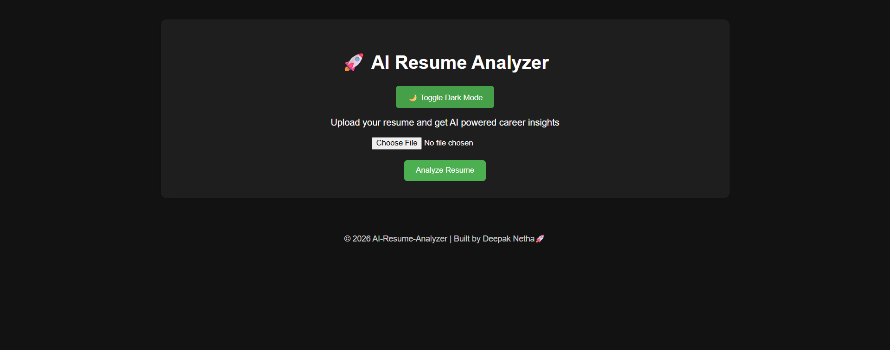

# 🚀 AI Resume Analyzer

AI Resume Analyzer is a web application that analyzes resumes and provides AI-powered career insights.

It predicts the best job role, calculates ATS score, identifies missing skills, and provides suggestions to improve resumes.

---

## 🌐 Live Demo

https://ai-resume-analyzer-eg8h.onrender.com/

---

## ✨ Features

- Resume Upload
- AI Role Prediction
- ATS Resume Score
- Skill Matching
- Missing Skills Detection
- AI Resume Feedback
- Skill Match Chart
- Dark Mode
- PDF Report Download

---

---

## 🖥 Dashboard

---

## 📊 Resume Analysis Result

.png)
.png)
.png)
.png)

## 🛠 Tech Stack

- Python
- Flask
- HTML
- CSS
- JavaScript
- Chart.js

---

## 👨‍💻 Author

Deepak Netha

© 2026 AI-Resume-Analyzer
